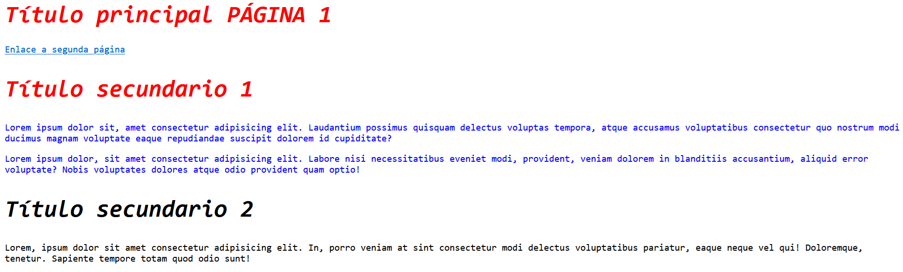
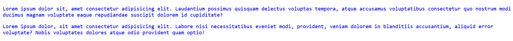

# Apuntes

## Indice

[GITHUB](README.md#github "GITHUB") 
- [Comandos GIT](README.md#comandos-git "Comandos GIT")
- [Otros comandos](README.md#comandos-git "Otros comandos") <br>

[MARKDOWN](README.md#markdown "MARKDOWN")

[HTML](README.md#html "HTML")
- [Fichero HTML](README.md#fichero-html "Fichero HTML")
- [Rutas](README.md#rutas "Rutas")
- [Etiquetas Generales](README.md#etiquetas-generales "Etiquetas Generales")
- [Etiquetas para body](README.md#etiquetas-para-body "Etiquetas para body")
- [Bloques de contenido](README.md#bloques-de-contenido "Bloques de contenido")
- [Tablas](README.md#tabla "Tabla") <br>

[CSS](README.md#css "CSS")
- [¿Qué és?](README.md#qué-és "¿Qué és?")
- [¿Con que funciona?](README.md#con-qué-funciona "¿Con qué funciona?")
- [Ubicación del css](README.md#ubicación-del-css "Ubicación del css")
- [Sintaxis básica](README.md#sintaxis-básica "Sintaxis básica")
- [Composición: display flex](README.md#composición-display-flex "Composición: display flex") <br>

[MEDIA QUERIES](README.md#media-queries "MEDIA QUERIES")
- [¿Para qué sirven?](README.md#para-qué-sirven "¿Para qué sirven?")
- [¿Cómo utilizarlo?](README.md#cómo-utilizarlo "¿Cómo utilizarlo?")

## GITHUB

Para empezar, debemos saber que **GITHUB** es una herramienta para la realización de **backups** de tu web o programa.

Nos podemos conectar a él mediante el **inicio de sesión** en él y la **creación de repositorios**, ¿cómo podemos conectarnos a un repositorio? Primero habrá que **crearlo**. Si vamos a Nuestro Perfil > Tus repositorios, podremos ver esta interfaz:


Podemos ver que a la parte superior derecha tenemos un botón en verde **new**. Clicamos en él para crear un **repositorio**.


Al clicar en él, veremos que nos aparece un formulario para rellenar diferentes datos. No centraremos en **Owner**, **Repository name**, **Description**, **Public or Private** y **Add a README file**.


| Propiedad | Descripción |
|:-------------------------:|:----------------------------------------------------------------:|
| **Owner** | Es el creador/propietario del repositorio |
| **Repository name** | Es el nombre que le asignas al repositorio |
| **Description** | La descripción del repositorio |
| **Public or Private** | Si quieres tener el repositorio en público o privado |
| **Add a README file** | Esta opción es recomendable siempre asignarla para la implementación de una estructura e información sobre tu repositorio |

[<button> Volver a inicio </button>](./README.md#indice "Volver a inicio")


### Comandos GIT
<hr>

Una vez creado el repositorio tenemos que conectarnos a él. Para ello abriremos el **CMD** dónde esté la carpeta que queremos subir y digitaremos ``git init`` para incorporar la herramienta **git**.


Primero revisaremos la rama en la que estamos utilizando ``git branch``. 


Si queremos cambiar de rama por dónde subir los cambios deberíamos digitar ``git branch -M (rama)``.


Después, clonaremos la carpeta al repositorio, para ello digitaremos ``git clone (url del repositorio)``.


Ahora, empezaremos con la subida de **archivos**, digitaremos ``git add "(ruta o nombre de los arhivos)``, esto añadirá todos los archivos que queremos subir.


Seguidamente, avanzaremos con los **commits**, o para entendernos, los backups. Digitaremos ``git commit -m "(nombre del backup)"``.


Para finalizar, digitamos ``git push origin (rama)`` para la subida de **backups** a **GITHUB**.


[<button> Volver a inicio </button>](./README.md#indice "Volver a inicio")

### Otros comandos
<hr>

| Comando | Trata de |
|:-------------------------:|:----------------------------------------------------------------:|
| ``git --version`` | Saber la versión de **GIT** |
| ``git config --global username "(usuario)"`` | Sincronizar carpetas locales a tu usuario de **GITHUB** |
| ``git config --global useremail "(correo)"`` | Sincronizar carpetas locales a tu correo de **GITHUB** |

[<button> Volver a inicio </button>](./README.md#indice "Volver a inicio")

## MARKDOWN

Para empezar, debemos saber que un fichero de tipo **MARKDOWN** acaba en ``.md``. En este podemos digitar una serie de combinaciones para hacer una descripción más visual. Por ejemplo, este documento está siendo escrito en un fichero de tipo **MARKDOWN**.


Al entrar en un documento ``.md`` podremos hacer una serie de combinaciones.

Primero empezaremos por los encabezados.

```
    #Encabezado nivel 1

    ## Encabezado nivel 2

    ### Encabezado nivel 3

    #### Encabezado nivel 4

    ##### Encabezado nivel 5

    ###### Encabezado nivel 6
```

Cada encabezado tiene su perspectivo tamaño de letra según su nivel.


Continuamos con los enlaces, haremos un enlace con:

``["Nombre del enlace"]((dirección/ruta del enalce) "Nombre que aparece al tener el ratón encima")``

Seguidamente, tenemos las imágenes, las cuales dispondremos de ellas mediante:

`` "Nombre que aparece al tener el ratón encima")``

También, dentro del **MARKDOWN** podemos utilizar etiquetas de **html**.

```html
    <p> Hola </p>
```
[<button> Volver a inicio </button>](./README.md#indice "Volver a inicio")

## HTML

### Fichero HTML
<hr>
Primero de todo, para crear un archivo **html** necesitamos una extension llamada **.html**. En cualquier fichero podemos cambiar la extensión a, por ejemplo: ```index.html```.


Para abrir el fichero podemos utilizar el **bloc de notas**, pero es más recomendable tener **Visual Studio Code** porque tiene muchas más funciones, mejor visualización del contenido y recomendaciones del propio **Visual Studio Code**.


Para empezar un **html** abreiremos el archivo y introducimos las siguientes líneas:
``` html

<!DOCTYPE html>
<html lang="es">
<head>
    <meta charset="UTF-8">
    <meta name="viewport" content="width=device-width, initial-scale=1.0">
    <title>Document</title>
</head>
<body>
    
</body>
</html>

```

Podemos introducir toda esta línea automáticamente con ```html:5``` y presionar **Enter**.

[<button> Volver a inicio </button>](./README.md#indice "Volver a inicio")

### Rutas
<hr>

En HTML se utilizan rutas para acceder a diferentes elementos, archivos, imágenes...

Existen dos tipos de ruta:

1. **Relativa**: Aquella que cuenta desde tu posición actual.
2. **Absoluta**: Aquellas que parte desde la raíz.

Por ejemplo:

**Estructura de carpetas**


EJ1 <br>
-> IMG <br>
EJ2 <br>
-> 'POSICIÓN ACTUAL' <br>


``` html

<body>

    <!-- Ruta relativa -->
    

    <!-- Ruta absoluta -->
    
</body>

```

Las rutas **relativas** se componen de:

1. ``..`` -> Para retroceder de directorio.
2. ``/archivo_o_directorio`` -> Seleccionar el archivo o directorio.
3. ``.`` -> Para moverte al mismo nivel en el que te encuentras.

Y, por último, las rutas **absolutas** se componen de:

1. ``/`` -> Raíz acompañado de:
   1. ``/archivo_o_directorio`` -> Seleccionar el archivo o directorio.

``/directiorio1/archivo.html``

[<button> Volver a inicio </button>](./README.md#indice "Volver a inicio")

### Etiquetas Generales
<hr>

Nos fijeramos en las etiquetas mostradas en el anterior ejemplo y empezaremos por ```<!DOCTYPE>``` y su atributo ```html```, la etiqueta indica que tipo de formato tiene el documento y su atributo especifica su lenguaje.

``` html

    <!-- Indica el tipo de lenguaje que utiliza -->

    <!DOCTYPE html>

    <!-- Este documento está formateado con html -->

```

Seguidamente, veremos que está la etiqueta ```<html lang="es">```, el ```html``` inicia lo que es el documento **html**, este especifica el idioma predeterminado el cual se hace la web, en este caso, el atributo indica que está en **español** ```"es"```. 

``` html

    <!-- Inicia la codificación html e indica el tipo de idioma predeterminado -->

    <html lang="es">

    <!-- Este documento tiene el idioma predeterminado como español -->

```

A continuación, veremos la etiqueta ```<head>(contenido)</head>```, podemos ver que tiene una etiqueta de apertura ```<>``` y una de cierre ```</>```, la etiqueta **head** es utilizada para todo proceso interno de la página web, es decir, la configuración de toda página, información que no es visible para el usuario.

``` html

<!-- Configuración que no ve el usuario -->
<head>

    <!-- El contenido que se muestra dentro no es visible para el usuario -->
    <!-- Es configuración del sistema -->
    <!DOCTYPE html>
    <html lang="es">

</head>
    <!-- Se cierra la etiqueta -->

```

Dentro del ```head```, podemos ver que hay unas etiquetas ```meta``` que explicaremos en estas líneas:

``` html

<!-- Utiliza las teclas de a-z A-Z y números 0-9 incluyendo carácteres especiales -->
<meta charset="UTF-8">

<!-- La pantalla estará en escala 1:1, es decir, lo que formateas es tal cuál se muestra -->
<meta name="viewport" content="width=device-width, initial-scale=1.0">

```

Otra etiqueta importante a recalcar es ```<title>(título)</title>```, este es importante ya que es el título de nuestra página web.

``` html

    <!-- Indica el título de la página -->

    <title>Prueba</title>

    <!-- Este documento se verá en la web con el título de Prueba -->

```

Para finalizar, veremos que existe una etiqueta ```<body>(contenido legible por el usuario)</body>```, el ```body``` es aquell contenido que veremos en nuestra web a base de etiquetas.

``` html

<!-- Inicia la parte visible de la página -->
<body>

</body>

```

[<button> Volver a inicio </button>](./README.md#indice "Volver a inicio")

### Etiquetas para body
<hr>

| Etiqueta | Descripción |
|:-------------------------:|:----------------------------------------------------------------:|
| ``<p>(texto)</p>`` | Sirven para añadir párrafos a tu página web. |
| ````| Sirve para integrar una imagen mediante la ruta de **src="(ruta)"**. | 
| ``<h*>(encabezado)</h*>`` | Puedes integrar encabezados y elegir su nivel (su número: **h1**, **h2**,...). |
| ``<ul>(lista desordenada)</ul>`` | Es para hacer una lista desordenada (**· Opción 1**, **· Opción 2**,...). |
| ``<ol>(lista ordenada)</ol>`` | Es para hacer una lista ordenada (**1.**, **2.**, **3.**,...). |
| ``<li>(iniciamos una opción de la lista)</li>``| Iniciamos una opción de la lista. |
| ``<a>(texto que va a enlazar)</a>`` | Sirve para insertar un enlace mediante el atributo **src="(ruta)"** dentro de la etiqueta ``<a>`` |
| ``<br>`` | Para hacer un **intro** en la web |
| ``<hr>`` | Para hacer una línea horizontal para mejor organización |
| ``<!-- (comentario) -->`` | Sirve para añadir un comentario que no saldrá por pantalla. |
| ``<b>(texto en negrita)`` | Sirve para poner un texto en negrita. |


Leyenda:

· ``*``: Número del 1-6.


[<button> Volver a inicio </button>](./README.md#indice "Volver a inicio")

### Bloques de contenido
<hr>

En ``html`` puedes crear un "esqueleto" del contenido de la web mediante etiquetas enfocadas para ello.

· ```<section>``` -> Este crea una sección(bloque) de contenido genérico, para organizar la posición del contenido.

· ```<article>``` -> Crea una sección de un contenido en específico, por ejemplo:

``` html

    <!-- Creas una sección dónde organizas el contenido, cada sección se puede caracterizar como a un tema diferente -->
    <section>

        <!-- Aquí añades un artículo para el texto -->
        <article>

            <p> Algo de texto </p>

        </article>

        <!-- Y aquí añades un artículo para la imagen -->
        <article>

            
        
        </article>

    </section> 

    <!-- Sirve para pura organización del contenido y un diseño más estructurado. A la hora de cambiar y rediseñar la web es más sencillo -->
```

· ```<span>``` -> Para seleccionar texto específico.

``` html

    <!-- Aquí seleccionas el texto que quieres editar y diseñar.-->
    <p> Esto <span>es un texto de</span> ejemplo. </p>


```

· ```<table>``` -> Para aplicar tablas en el **html**.

``` html

    <table>

        <!-- Encabezado de la tabla -->
        <thead>

            <th>
                Encabezado
            </th>

        </thead>

        <!-- Fila de la tabla -->
        <tr>

            <td>
                Ejemplo
            </td>

        </tr>

    </table>

```
[<button> Volver a inicio </button>](./README.md#indice "Volver a inicio")

### Tabla
<hr>

Se utilizan diferentes etiquetas para realizar una tabla. Aplicaremos la etiqueta ```<table>``` para formatear una tabla, seguidamente, dispondremos de los ``<thead>`` para marcar el encabezado de la tabla. Después, utilizaremos el ``<tfoot>`` para aplicar un pie de página a la tabla. Finalmente, dispondremos del contenido principal que los haremos mediante filas ``<tr>``.

```html

<table>

    <!-- Estructura de la tabla -->

    <thead>
        <!-- Contenido del encabezado -->
    </thead>

    <tr>
        <!-- Contenido central -->
    </tr>

    <tfoot>
        <!-- Contenido del pie de la tabla -->
    </tfoot>

</table>

```

Dentro de estas etiquetas que son para estructurar una tabla, dispondremos de varias etiquetas que representan las celdas de cada fila. Se utiliza ``<td>`` y ``<th>``. El ``<td>`` sirve para aplicar celdas normales y el ``<th>`` para encabezados y pies de página.

``` html

<table>

    <!-- Estructura de la tabla -->

    <thead> 
        <!-- Encabezado -->
        <th>
            <p> Ejemplo de encabezado. </p>
        </th>
    </thead>

    <tr>
        <!-- Primera fila -->
        <td>
            <!-- Primera celda -->
            <p> Primera celda de la primera fila. </p>
        </td>
        <td>
            <!-- Segunda celda -->
            <p> Segunda celda de la primera fila. </p>
        </td>
    </tr>

    <tr>
        <!-- Segunda fila -->
        <td>
            <!-- Primera celda -->
            <p> Primera celda de la segunda fila. </p>
        </td>
    </tr>

    <tfoot>
        <!-- Pie de tabla -->
        <th>
            <p> Ejemplo de pie de tabla. </p>
        </th>
    </tfoot>

</table>

```

[<button> Volver a inicio </button>](./README.md#indice "Volver a inicio")

## CSS

### Qué és
<hr>

Es una hoja de estilos que sirve para aplicarle una mayor apariencia a tu página web, esto hace que los usuarios capten mejor la información y sea muy agradable visualmente, para así aumentar los usuarios a tu web y que tu servicio se vea claro y atractivo.


[<button> Volver a inicio </button>](./README.md#indice "Volver a inicio")

### Con qué funciona
<hr>

Esta hoja de estilos funciona mediante **clases**, **identificadores** y el resto son parámetros para aplicar a esas **clases**, **etiquetas** e **identificadores**.

``` css

.clase{

    /* Parámetros */

}

#id {

    /* Parámetros */

}

etiqueta{

    /* Parámetros */

}

```

[<button> Volver a inicio </button>](./README.md#indice "Volver a inicio")

### Ubicación del CSS
<hr>

Para aplicar estilo a tu página necesitarás la ubicación de una hoja de estilos, para ello existen **3 formas** de poder implementar en tu web un estilo.

1. Mediante la etiqueta ``<style>``. (Interno)

Este se implementa dentro del archivo en el ``<head>``, podemos aplicar varios estilos dentro de él.

``` html

<head>
<style>

h2, h1{ /* Encabezados */
    color: #FF0000;
    font-style: italic;
    font-size: 40px;
}

p{ /* Párrafo */
    color: #0000FF;
}

.footer { /* Pie de página */

    color: black;

}

</style>
</head>

```




2. Mediante asignación del ``<style>`` en la propia etiqueta. (Inline)

Puedes aplicar estilo a una etiqueta en concreto.

``` html

<!-- Le aplicamos estilo al párrafo -->
<p style="color:blue;"> Este párrafo se verá en azul. </p>

```


3. Mediante una hoja de estilos externo **.css** enlazado con el archivo. (Externo)

Se puede aplicar un archivo externo para una mayor organización del trabajo.

``` html

<head>

    <!-- Para enlazar al archivo css -->
    <link rel="stylesheet" href="./estilos/estilo_ejemplo.css">

</head>

```

[<button> Volver a inicio </button>](./README.md#indice "Volver a inicio")

### Sintaxis básica
<hr>

#### Selectores de hijos
<hr>

Sirven para seleccionar un elemento hijo, es decir, al seleccionar una clase, id o etiqueta este puede llegar a contener dentro otras etiquetas, clases o ids. Para gestionar mejor la organización del **css**, puedes implementar la característica ``.clase_padre > .clase_hijo{}``. Con esto estás especificando que el elemento **DIRECTO** interno se verá afectado.

``` css

.padre{

    color: red;

}

.padre > h2{

    color:blue;

}

```

En este ejemplo estás especificando que todos los ``<h2>`` de la clase **padre** se formatearán de color azul, mientras que la clase **padre** se formatea de color rojo.

[<button> Volver a inicio </button>](./README.md#indice "Volver a inicio")

#### Selectores de hermanos adyacentes
<hr>

Aquellos que son posteriores de la etiqueta seleccionada. Estos se especifican con un ``+``, por ejemplo:

``` html

<!-- HTML -->

<h1> Primer título </h1>

<h2> Hermano adyacente del primer título </h2>

```
``` css

/* CSS */

h1+h2{

    color: red;

}

```

Podemos saber que la etiqueta ``<h2>`` adyacente (contínuo) a la etiqueta ``<h1>`` se formateará de color **rojo**.

[<button> Volver a inicio </button>](./README.md#indice "Volver a inicio")

#### Pseudoclases
<hr>

Estos son definiciones de los estilos, estos especifican el estado del elemento. Por ejemplo:

1. **:link**: El estado por defecto de los enlaces.
2. **:visited**: Enlaces que ya se han visitado.
3. **:focus**: Elementos que contienen el cursor en su interior.
4. **:hover**: Elementos que tienen en ese momento el cursor por encima.

[<button> Volver a inicio </button>](./README.md#indice "Volver a inicio")

#### Pseudoelementos
<hr>

Añaden estilos a una parte concreta del elemento, por ejemplo:

``` css

    /* La primera línea de la estiqueta <p> es de color rojo */
    p::first-line{

        color:red;

    }

```

[<button> Volver a inicio </button>](./README.md#indice "Volver a inicio")

### Composición: display flex
<hr>

#### ¿Qué és?
<hr>

Es un método para adaptar toda la estructura de contenedores y objetos a una mejor visualización del mismo, también, el **display**, se utiliza para organizar el contenido dependiendo del dispositivo que esté visualizando el contenido, por ejemplo:

· No se lo mismo ver 4 contenedores grandes en un ordenador que en un teléfono móvil.

Por eso mismo se utiliza el ``display: block`` y el ``display: flex``.

[<button> Volver a inicio </button>](./README.md#indice "Volver a inicio")

#### Utilidad
<hr>

Al querer estructurar una página, es muy atractivo ver todos los contenedores con un estilo llamativo, grande y ver todo el contenido en un momento.

A partir de ese punto podemos utilizar el **display**.

Hagamos un ejemplo. Si yo quisiera que desde una pantalla de ordenador se viesen 4 contenedores juntos, pero en el teléfono móvil 2 arriba y 2 abajo, debería de utilizar el **display: flex** acompañado seguidamente de un ``@media screen (max-width: 700px, /*por ejemplo*/)``, el cuál dentro dispondrá de un **display: block**. La estructura será la siguiente:

``` html

<!-- HTML -->

<section class="display"> <!-- Aquí aplicaremos el display flex o block, dependiendo del ancho de pantalla -->
    <section class="block_1">
        <!-- Primera sección, la cuál ocupará un 50%, al aplicar el ancho de pantalla determinado ocupará el 100% -->
        <!-- Cada uno de estos artículos ocuparán el 50% de la sección -->
        <article>
            <p> Primer bloque <p>
        </article>
        <article>
            <p> Segundo bloque <p>
        </article>

    </section>
    <section class="block_2">
        <!-- Segunda sección, la cuál ocupará otro 50%, al aplicar el ancho de pantalla determinado ocupará el 100% -->
        <!-- Cada uno de estos artículos ocuparán el 50% de la sección -->
        <article>
            <p> Primer bloque <p>
        </article>
        <article>
            <p> Segundo bloque <p>
        </article>

    </section>
</section>
```

``` css
/* CSS */

.display{

    /* Aplicamos el 100% del espacio en el section del display */
    width: 100%;
    display: flex;
    /* Añadimos el display flex que combina las dos secciones en una misma fila */

}

/* Aplicamos que los dos bloques ocupan el 50% del ancho de página, ya que, los dos están en la misma fila */
.block_1, .block_2{

    width: 50%;

}

/* Aplicamos que dentro de cada articulo que se situe en estos bloques, como son dos, que contengan el 50% cada uno */
.block_1 > article, .block_2 > article{

    width: 50%;

}

/* MEDIA QUERIES */
/* Cuando el dispositivo ocupe 700px de ancho: */
@media screen (max-width: 700px){

    .display{

        /* Hacemos que todos los bloques estén separados, cada uno por su lado, ahora se dividen en dos filas
        
        SECTION 1
        SECTION 2

        */
        display: block;

    }

    /* Ya que, están separados, les decimos que ocupen el 100%, así aprovechamos toda la fila */
    .block_1, .block_2{

        width: 100%;

    }

}


```

[<button> Volver a inicio </button>](./README.md#indice "Volver a inicio")

#### Propiedades
<hr>

Hay diferentes propiedades y configuraciones del propio **display**, estos son:

1. ``flex-direction:``.
   1. ``row``: Aplica los objetos en fila / línea.
   2. ``row-reverse``: Aplica los objetos en fila / línea a la inversa.
   3. ``column``: En columna.
   4. ``column-reverse``: En columna a la inversa.
2. ``flex-wrap:``.
   1. ``no-wrap``: Ningún cambio.
   2. ``wrap``: El contenido que no quepa se desplaza hacia abajo.
   3. ``wrap-reverse``: El contenido que no quepa se desplaza hacia arriba.
3. ``justify-content:``.
   1. ``flex-start``: La disposición del contenido empieza al principio.
   2. ``flex-end``: La dispisicón del contenido empieza al final.
   3. ``center``: La disposición del contenido se sitúa en el centro.
   4. ``space-between``: Añade espaciados entre los elementos proporcional a la amplitud de la página.
   5. ``space-around``: Este aplica espaciado de la mitad de un elemento y del otro.
   6. ``space-evenly``: Aplica espaciado proporcional a la amplitud de la página (incluyendo el espaciado del borde).
4. ``align-items:``.
   1. ``flex-start``: Distribuye el contenido arriba de todo.
   2. ``flex-end``: Distribuye el contenido al final de todo.
   3. ``center``: Distribuye el contenido al centro.
   4. ``stretch``: Distribuye el contenido en toda la longitud permitida.
5. ``align-content:``.
   1. ``flex-start``: La disposición del contenido empieza al principio.
   2. ``flex-end``: La dispisicón del contenido empieza al final.
   3. ``center``: La disposición del contenido se sitúa en el centro.
   4. ``stretch``: Aplica el contenido del centro más estrecho para su visualización correcta.
   5. ``space-between``: Este aplica espaciado de la mitad de una fila y de otra.
   6. ``space-around``: Aplica espaciado proporcional a la longitud de la página (incluyendo el espaciado del borde).

[<button> Volver a inicio </button>](./README.md#indice "Volver a inicio")


## Media queries

### Para qué sirven
<hr>

Controlan la amplitud del dispositivo que esté navegando por la web. Cada dispositivo tiene una amplitud y altitud diferente y todo el contenido puede verse afectado, por ello existen las **media queries**.

[<button> Volver a inicio </button>](./README.md#indice "Volver a inicio")

### Cómo utilizarlo
<hr>

Primero de todo, deberás utilizar una **hoja de estilos** dónde ahí, podrás aplicar todos los estilos de todos los elementos. En ese mismo archivo aplicarás las **media queries** que se definen de la siguiente manera:

``` css

@media screen (max-width: /* Píxeles de la pantalla */){

    /* Elementos y parámetros que quieres cambiar */

}

```

Si hemos aplicado estilos para una pantalla **1920px** y queremos aplicarlo a un teléfono móvil, podremos aplicarlo mediante la amplitud marcada por **píxeles**.

``` css

@media screen (max-width: 700px){ /* Simulación de teléfono móvil */

    /* Cuando se aplique la norma de 700px de amplitud, toda la página será de color rojo */
    body{

        color: red;

    }

    /* Cambiamos su tamaño a 100% y su tamaño de letra para que se vea más encajado en el dispositivo */
    .block1{

        width: 100%;
        font-size: 20px;

    }

    .block2{

        width: 100%;
        font-size: 10px;

    }

}

```
[<button> Volver a inicio </button>](./README.md#indice "Volver a inicio")

