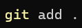

# Apuntes

## Indice

[· GITHUB](README.md#github "GITHUB")

[· MARKDOWN](README.md#markdown "MARKDOWN")

[· HTML](./README.md#html "HTML")

## GITHUB

Para empezar, debemos saber que **GITHUB** es una herramienta para la realización de **backups** de tu web o programa.

Nos podemos conectar a él mediante el **inicio de sesión** en él y la **creación de repositorios**, ¿cómo podemos conectarnos a un repositorio? Primero habrá que **crearlo**. Si vamos a Nuestro Perfil > Tus repositorios, podremos ver esta interfaz:


Podemos ver que a la parte superior derecha tenemos un botón en verde **new**. Clicamos en él para crear un **repositorio**.


Al clicar en él, veremos que nos aparece un formulario para rellenar diferentes datos. No centraremos en **Owner**, **Repository name**, **Description**, **Public or Private** y **Add a README file**.


| Propiedad | Descripción |
|:-------------------------:|:----------------------------------------------------------------:|
| **Owner** | Es el creador/propietario del repositorio |
| **Repository name** | Es el nombre que le asignas al repositorio |
| **Description** | La descripción del repositorio |
| **Public or Private** | Si quieres tener el repositorio en público o privado |
| **Add a README file** | Esta opción es recomendable siempre asignarla para la implementación de una estructura e información sobre tu repositorio |

[<button> Volver a inicio </button>](./README.md#indice "Volver a inicio")


### Comandos GIT

Una vez creado el repositorio tenemos que conectarnos a él. Para ello abriremos el **CMD** dónde esté la carpeta que queremos subir y digitaremos ``git init`` para incorporar la herramienta **git**.


Primero revisaremos la rama en la que estamos utilizando ``git branch``. 


Si queremos cambiar de rama por dónde subir los cambios deberíamos digitar ``git branch -M (rama)``.


Después, clonaremos la carpeta al repositorio, para ello digitaremos ``git clone (url del repositorio)``.


Ahora, empezaremos con la subida de **archivos**, digitaremos ``git add "(ruta o nombre de los arhivos)``, esto añadirá todos los archivos que queremos subir.



Seguidamente, avanzaremos con los **commits**, o para entendernos, los backups. Digitaremos ``git commit -m "(nombre del backup)"``.


Para finalizar, digitamos ``git push origin (rama)`` para la subida de **backups** a **GITHUB**.


[<button> Volver a inicio </button>](./README.md#indice "Volver a inicio")

### Otros comandos

| Comando | Trata de |
|:-------------------------:|:----------------------------------------------------------------:|
| ``git --version`` | Saber la versión de **GIT** |
| ``git config --global username "(usuario)"`` | Sincronizar carpetas locales a tu usuario de **GITHUB** |
| ``git config --global useremail "(correo)"`` | Sincronizar carpetas locales a tu correo de **GITHUB** |

[<button> Volver a inicio </button>](./README.md#indice "Volver a inicio")

## MARKDOWN

Para empezar, debemos saber que un fichero de tipo **MARKDOWN** acaba en ``.md``. En este podemos digitar una serie de combinaciones para hacer una descripción más visual. Por ejemplo, este documento está siendo escrito en un fichero de tipo **MARKDOWN**.


Al entrar en un documento ``.md`` podremos hacer una serie de combinaciones.

Primero empezaremos por los encabezados.

```
    #Encabezado nivel 1

    ## Encabezado nivel 2

    ### Encabezado nivel 3

    #### Encabezado nivel 4

    ##### Encabezado nivel 5

    ###### Encabezado nivel 6
```

Cada encabezado tiene su perspectivo tamaño de letra según su nivel.


Continuamos con los enlaces, haremos un enlace con:

``["Nombre del enlace"]((dirección/ruta del enalce) "Nombre que aparece al tener el ratón encima")``

Seguidamente, tenemos las imágenes, las cuales dispondremos de ellas mediante:

`` "Nombre que aparece al tener el ratón encima")``

También, dentro del **MARKDOWN** podemos utilizar etiquetas de **html**.

```html
    <p> Hola </p>
```
[<button> Volver a inicio </button>](./README.md#indice "Volver a inicio")

## HTML

### Fichero HTML
Primero de todo, para crear un archivo **html** necesitamos una extension llamada **.html**. En cualquier fichero podemos cambiar la extensión a, por ejemplo: ```index.html```.


Para abrir el fichero podemos utilizar el **bloc de notas**, pero es más recomendable tener **Visual Studio Code** porque tiene muchas más funciones, mejor visualización del contenido y recomendaciones del propio **Visual Studio Code**.


Para empezar un **html** abreiremos el archivo y introducimos las siguientes líneas:
``` html

<!DOCTYPE html>
<html lang="es">
<head>
    <meta charset="UTF-8">
    <meta name="viewport" content="width=device-width, initial-scale=1.0">
    <title>Document</title>
</head>
<body>
    
</body>
</html>

```

Podemos introducir toda esta línea automáticamente con ```html:5``` y presionar **Enter**.

[<button> Volver a inicio </button>](./README.md#indice "Volver a inicio")

### Etiquetas

Nos fijeramos en las etiquetas mostradas en el anterior ejemplo y empezaremos por ```<!DOCTYPE>``` y su atributo ```html```, la etiqueta indica que tipo de formato tiene el documento y su atributo especifica su lenguaje.

``` html

    <!-- Indica el tipo de lenguaje que utiliza -->

    <!DOCTYPE html>

    <!-- Este documento está formateado con html -->

```

Seguidamente, veremos que está la etiqueta ```<html lang="es">```, el ```html``` inicia lo que es el documento **html**, este especifica el idioma predeterminado el cual se hace la web, en este caso, el atributo indica que está en **español** ```"es"```. 

``` html

    <!-- Inicia la codificación html e indica el tipo de idioma predeterminado -->

    <html lang="es">

    <!-- Este documento tiene el idioma predeterminado como español -->

```

A continuación, veremos la etiqueta ```<head>(contenido)</head>```, podemos ver que tiene una etiqueta de apertura ```<>``` y una de cierre ```</>```, la etiqueta **head** es utilizada para todo proceso interno de la página web, es decir, la configuración de toda página, información que no es visible para el usuario.

``` html

<!-- Configuración que no ve el usuario -->
<head>

    <!-- El contenido que se muestra dentro no es visible para el usuario -->
    <!-- Es configuración del sistema -->
    <!DOCTYPE html>
    <html lang="es">

</head>
    <!-- Se cierra la etiqueta -->

```

Dentro del ```head```, podemos ver que hay unas etiquetas ```meta``` que explicaremos en estas líneas:

``` html

<!-- Utiliza las teclas de a-z A-Z y números 0-9 incluyendo carácteres especiales -->
<meta charset="UTF-8">

<!-- La pantalla estará en escala 1:1, es decir, lo que formateas es tal cuál se muestra -->
<meta name="viewport" content="width=device-width, initial-scale=1.0">

```

Otra etiqueta importante a recalcar es ```<title>(título)</title>```, este es importante ya que es el título de nuestra página web.

``` html

    <!-- Indica el título de la página -->

    <title>Prueba</title>

    <!-- Este documento se verá en la web con el título de Prueba -->

```

Para finalizar, veremos que existe una etiqueta ```<body>(contenido legible por el usuario)</body>```, el ```body``` es aquell contenido que veremos en nuestra web a base de etiquetas.

``` html

<!-- Inicia la parte visible de la página -->
<body>

</body>

```

[<button> Volver a inicio </button>](./README.md#indice "Volver a inicio")

### Etiquetas para body

| Etiqueta | Descripción |
|:-------------------------:|:----------------------------------------------------------------:|
| ``<p>(texto)</p>`` | Sirven para añadir párrafos a tu página web. |
| ````| Sirve para integrar una imagen mediante la ruta de **src="(ruta)"**. | 
| ``<h*>(encabezado)</h*>`` | Puedes integrar encabezados y elegir su nivel (su número: **h1**, **h2**,...). |
| ``<ul>(lista desordenada)</ul>`` | Es para hacer una lista desordenada (**· Opción 1**, **· Opción 2**,...). |
| ``<ol>(lista ordenada)</ol>`` | Es para hacer una lista ordenada (**1.**, **2.**, **3.**,...). |
| ``<li>(iniciamos una opción de la lista)</li>``| Iniciamos una opción de la lista. |
| ``<a>(texto que va a enlazar)</a>`` | Sirve para insertar un enlace mediante el atributo **src="(ruta)"** dentro de la etiqueta ``<a>`` |
| ``<br>`` | Para hacer un **intro** en la web |
| ``<hr>`` | Para hacer una línea horizontal para mejor organización |
| ``<!-- (comentario) -->`` | Sirve para añadir un comentario que no saldrá por pantalla. |
| ``<b>(texto en negrita)`` | Sirve para poner un texto en negrita. |


Leyenda:

· ``*``: Número del 1-6.


[<button> Volver a inicio </button>](./README.md#indice "Volver a inicio")